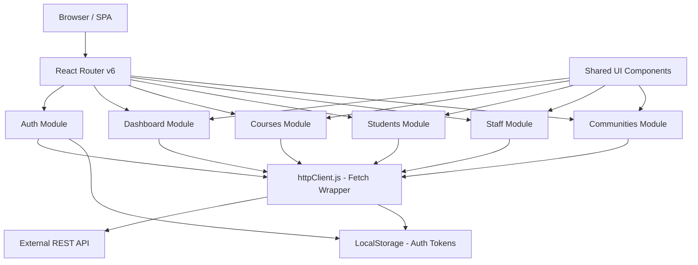
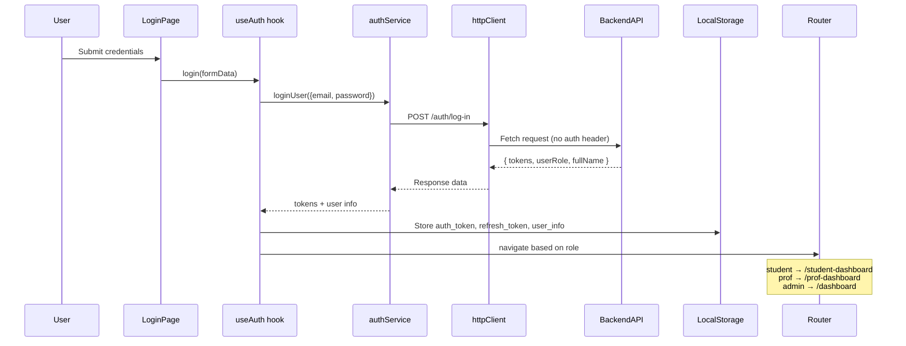
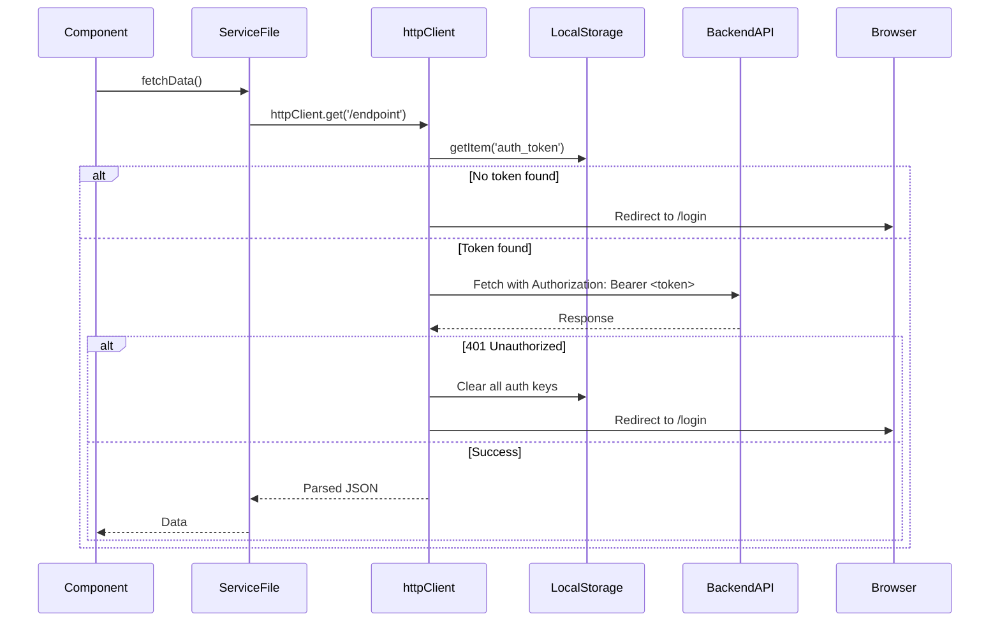

# EduVers — AI Development Guide
> **Version:** 1.0 | **Last Updated:** June 2026
> **Purpose:** Single source of truth for any AI assistant, developer, or contributor working on this project.

---

## Table of Contents

1. [Project Overview](#1-project-overview)
2. [System Architecture](#2-system-architecture)
3. [Technology Stack](#3-technology-stack)
4. [Folder Structure](#4-folder-structure)
5. [Application Flow](#5-application-flow)
6. [API Documentation](#6-api-documentation)
7. [State Management Guide](#7-state-management-guide)
8. [Component Development Standards](#8-component-development-standards)
9. [Coding Standards](#9-coding-standards)
10. [Error Handling Guide](#10-error-handling-guide)
11. [Security Guidelines](#11-security-guidelines)
12. [Environment Configuration](#12-environment-configuration)
13. [Deployment Guide](#13-deployment-guide)
14. [Known Issues & Edge Cases](#14-known-issues--edge-cases)
15. [AI Assistant Working Rules](#15-ai-assistant-working-rules)
16. [Feature Development Workflow](#16-feature-development-workflow)
17. [Project Knowledge Base](#17-project-knowledge-base)
18. [AI Context Summary](#18-ai-context-summary)

---

## 1. Project Overview

### Project Name
**EduVers** (EMA-X / Edu-vers)

### Project Purpose
EduVers is a comprehensive **University Education Management System** (EMS) that serves three distinct types of users: Admins, Professors, and Students. It provides a unified platform to manage academic operations including student enrollment, course management, community clubs, staff management, and AI-powered academic assistance.

### Business Goals
- Digitize university academic operations
- Provide role-specific dashboards and flows for Admin, Professor, and Student
- Enable community building among students through clubs
- Offer AI academic assistance to students
- Support multi-role authentication and authorization

### Target Users

| Role | Description |
|------|-------------|
| **Admin** | Manages students, staff, courses, and communities |
| **Professor** | Views their dashboard with student data and grade analytics |
| **Student** | Browses courses, manages registrations, joins communities, and interacts with AI assistant |

### Main Features
- 🔐 Multi-role authentication (Admin / Professor / Student)
- 📊 Role-specific dashboards with analytics
- 👥 Student management (CRUD)
- 👨‍🏫 Academic staff management (CRUD)
- 📚 Course management (CRUD, registration)
- 🏘️ Community clubs (create, join, rate, post)
- 🤖 AI Academic Assistant chatbot drawer
- 📅 Student schedule viewer
- 🌟 Community rating system

### System Scope
This is a **frontend-only** React SPA (Single Page Application) that communicates with an external REST API backend. There is no backend code in this repository.

### Future Roadmap
- Real-time notifications
- Student grade submission
- Full course registration flow with backend
- Community real-time posts/chat
- Dark mode

---

## 2. System Architecture

### High-Level Architecture



### Authentication Flow



### Role-Based Navigation

```mermaid
graph LR
    Login --> A{User Role?}
    A -->|admin| AdminDashboard[/dashboard]
    A -->|professor| ProfDashboard[/prof-dashboard]
    A -->|student| StudentDashboard[/student-dashboard]
    StudentDashboard --> StudentCourses[/student-courses]
    StudentDashboard --> StudentCommunities[/student-communities]
    AdminDashboard --> Students[/dashboard/students]
    AdminDashboard --> Staff[/dashboard/staff]
    AdminDashboard --> Courses[/dashboard/courses]
    AdminDashboard --> Communities[/dashboard/communities]
```

### Request Lifecycle (Protected Routes)



---

## 3. Technology Stack

### Frontend

| Category | Technology | Details |
|----------|-----------|---------|
| **Framework** | React 18 | Functional components with hooks only |
| **Build Tool** | Vite | Fast HMR, ESM-based builds |
| **Routing** | React Router v6 | `<Routes>` + lazy loading |
| **Styling** | Tailwind CSS v4 | Utility-first, custom design tokens via `@theme` |
| **Icons** | Lucide React | Consistent icon set |
| **Forms** | React Hook Form | All auth forms |
| **Validation** | Yup + @hookform/resolvers | Schema-based validation |
| **Charting** | Recharts | GPA line chart |
| **Toasts** | React Hot Toast | User notifications |
| **HTTP** | Native Fetch API | Wrapped in `httpClient.js` |
| **Font** | Inter (Google Fonts) | All UI text |

### Design System (Custom Tokens)

```css
/* Defined in src/index.css via @theme */
--color-main: #15B392;        /* Primary teal brand color */
--color-main-hover: #129a7d;  /* Hover state */
--color-lighter-main: #E5F6F3; /* Light teal backgrounds */
--color-dark-blue: #233142;   /* Main text/heading color */
--color-dark-text: #0F172A;   /* Dark body text */
--color-gray-text: #64748B;   /* Secondary text */
--color-gray-light: #94A3B8;  /* Disabled/placeholder */
--color-bg-app: #F4F7F6;      /* App background */
--color-percentage-up: #00C853;
--color-percentage-down: #FF3D00;
```

---

## 4. Folder Structure

```
Edu-vers/
├── src/
│   ├── App.jsx                    # Root component — mounts ErrorBoundary + AppRouter
│   ├── main.jsx                   # Entry point — ReactDOM.createRoot, BrowserRouter
│   ├── index.css                  # Global styles, Tailwind import, @theme tokens, keyframes
│   ├── App.css                    # Legacy CSS (mostly unused, keep but don't add to)
│   │
│   ├── app/                       # App-level infrastructure
│   │   ├── layouts/               # Page layout wrappers
│   │   │   └── DashboardLayout.jsx # Sidebar + Topbar + main content wrapper
│   │   ├── providers/             # Error boundaries, context providers
│   │   │   └── ErrorBoundary.jsx
│   │   └── router/                # Route definitions
│   │       ├── AppRouter.jsx      # All routes declared here with lazy loading
│   │       └── index.js           # Re-exports AppRouter
│   │
│   ├── modules/                   # Feature modules (domain-driven)
│   │   ├── auth/                  # Authentication module
│   │   │   ├── components/        # AuthHeader, PasswordField, FormActions
│   │   │   ├── constants/         # authConstants.js (routes, page copy)
│   │   │   ├── hooks/             # useAuth.js
│   │   │   ├── layouts/           # AuthLayout.jsx
│   │   │   ├── pages/             # LoginPage, ForgotPasswordPage, OTPVerificationPage, ResetPasswordPage
│   │   │   ├── services/          # authService.js
│   │   │   └── validations/       # loginSchema.js, etc.
│   │   │
│   │   ├── dashboard/             # Dashboard module
│   │   │   ├── components/        # StudentStatCard, GPALineChart, TopCoursesGrades,
│   │   │   │                      # DashboardFilter, DashboardAnnouncements,
│   │   │   │                      # AcademicAssistantBanner, AcademicAssistantDrawer,
│   │   │   │                      # DashboardCommunities, CoursesCompletionModal
│   │   │   └── pages/             # DashboardPage (admin), StudentDashboardPage, ProfDashboardPage
│   │   │
│   │   ├── courses/               # Courses module
│   │   │   ├── components/        # Course-related components
│   │   │   │                      # StudentCourseCard, StudentScheduleModal,
│   │   │   │                      # CoursesToolbar, CourseActionsCell, etc.
│   │   │   ├── hooks/             # useCourses.js
│   │   │   ├── pages/             # CoursesPage (admin), StudentCoursesPage,
│   │   │   │                      # CreateCoursePage, CourseDetailsPage
│   │   │   └── services/          # coursesService.js
│   │   │
│   │   ├── students/              # Students module
│   │   │   ├── components/        # CreateStudentModal, EditStudentModal
│   │   │   ├── hooks/             # useStudents.js
│   │   │   ├── pages/             # StudentsPage
│   │   │   └── services/          # studentsService.js
│   │   │
│   │   ├── staff/                 # Academic Staff module
│   │   │   ├── components/        # CreateStaffModal, EditStaffModal
│   │   │   ├── hooks/             # useStaff.js
│   │   │   ├── pages/             # StaffPage
│   │   │   └── services/          # staffService.js
│   │   │
│   │   └── communities/           # Communities module
│   │       ├── pages/             # CommunitiesPage (admin), StudentCommunitiesPage,
│   │       │                      # CommunityDetailsPage
│   │       └── services/          # communitiesService.js
│   │
│   └── shared/                    # Cross-module shared code
│       ├── constants/             # appConstants.js (ROUTES, APP_NAME, PAGE_SIZE_DEFAULT)
│       ├── hooks/                 # Global reusable hooks
│       ├── services/              # httpClient.js
│       ├── ui/                    # Reusable UI component library
│       │   ├── Button/            # Button.jsx + index.js
│       │   ├── Card/              # Card.jsx + index.js
│       │   ├── ConfirmModal/      # ConfirmModal.jsx + index.js
│       │   ├── EmptyState/        # EmptyState.jsx + index.js
│       │   ├── FormField/         # FormField.jsx + index.js
│       │   ├── Input/             # Input.jsx + index.js
│       │   ├── Loader/            # Loader.jsx + index.js
│       │   ├── Modal/             # Modal.jsx + index.js
│       │   ├── Pagination/        # Pagination.jsx + index.js
│       │   ├── Select/            # Select.jsx + index.js
│       │   ├── Sidebar/           # Sidebar.jsx + index.js
│       │   ├── Table/             # Table.jsx + index.js
│       │   ├── Topbar/            # Topbar.jsx + index.js
│       │   └── index.js           # Re-exports all UI components
│       └── utils/                 # Utility functions
│
├── AI-Guide.md                    # This file
├── package.json
├── vite.config.js
├── tailwind.config.js (if applicable)
└── .env                           # Environment variables (NOT committed to git)
```

### Directory Responsibility Rules

| Directory | ✅ Should Contain | ❌ Should NOT Contain |
|-----------|------------------|----------------------|
| `app/router/` | Route definitions, lazy imports | Business logic, data fetching |
| `app/layouts/` | Layout shells (Sidebar+Topbar wrap) | Page-specific content |
| `modules/[name]/pages/` | Full page components | Reusable UI fragments |
| `modules/[name]/components/` | Module-specific components | Cross-module components |
| `modules/[name]/hooks/` | Business-logic hooks | Pure UI logic |
| `modules/[name]/services/` | API call functions | State management, UI |
| `shared/ui/` | Fully reusable, generic UI components | Business logic, API calls |
| `shared/constants/` | App-wide constants | Computed values, functions |
| `shared/services/` | httpClient.js | Module-specific services |

---

## 5. Application Flow

### 5.1 Authentication Flow

**Trigger:** User visits `/login`

**Steps:**
1. User fills email + password form (validated by `loginSchema` via Yup)
2. `useAuth.login()` calls `authService.loginUser()`
3. `httpClient.post('/auth/log-in')` (no auth header on public routes)
4. On success: stores `auth_token`, `refresh_token`, `user_info` in `localStorage`
5. Role-based redirect:
   - `student` → `/student-dashboard`
   - `prof` / `professor` → `/prof-dashboard`
   - `admin` / anything else → `/dashboard`
6. **Special case:** If API returns "You should confirm your email first", navigates to `/verify-otp` with email in state

**Error Scenarios:**
- Wrong credentials → show server error message inline
- Unconfirmed email → redirect to OTP page
- Network failure → show generic error

### 5.2 Password Reset Flow

**Steps:**
1. User clicks "Forgot password?" → `/forgot-password`
2. Enters email → `POST /auth/forgot-password` → OTP sent to email
3. User redirected to `/verify-otp` to enter OTP
4. On valid OTP → `/reset-password`
5. User enters new password → `POST /auth/reset-password`
6. On success → redirect to `/login`

### 5.3 Admin Dashboard Flow

**Route:** `/dashboard`
**Page:** `DashboardPage.jsx`

- Reads `user_info` from `localStorage` to personalize greeting
- Displays static stat cards (Total Students, Total Courses, Total Doctors, Registered Courses)
- Bar chart with enrollment data filterable by date range (Last 3 Months / Last 6 Months / Last Year)
- Course distribution progress bars
- Recent students mini-table (currently static/mock data)

### 5.4 Student Dashboard Flow

**Route:** `/student-dashboard`
**Page:** `StudentDashboardPage.jsx`

**Components rendered:**
- `StudentStatCard` × 3 (GPA, Registered Courses, Applied Training)
- `GPALineChart` (Recharts, with year filter dropdown)
- `TopCoursesGrades` (progress bars + "View All Statistics" → `CoursesCompletionModal`)
- `DashboardFilter` (semester/year dropdowns)
- `DashboardAnnouncements` (announcements list)
- `AcademicAssistantBanner` → opens `AcademicAssistantDrawer`
- `DashboardCommunities` (list of joined communities)

### 5.5 Academic Assistant (AI Chat Drawer) Flow

**Trigger:** Click "ACADEMIC ASSISTANT" card/banner

**Features:**
- Slide-in drawer from right (no backdrop, page remains visible)
- Quick Actions panel (disappears once messages exist)
- Text input + Enter key to send
- File upload via paperclip icon (accepts `image/*` and `.pdf`)
- File upload animation: "Uploading..." spinner then "Ready" status
- Bot typing animation (3 bouncing dots)
- Mock bot response after 2.5s delay
- All messages use `break-words` class to prevent overflow

### 5.6 Student Courses Flow

**Route:** `/student-courses`
**Page:** `StudentCoursesPage.jsx`

- Header with "+ Add Course" and "View My Schedule" buttons
- 4 stats cards in a row: Registered, Available, Total Credits, Tasks
- Filter row: Available/Registered toggle, department dropdown, semester dropdown, Courses Tree
- Grid of `StudentCourseCard` components (4 per row on XL)
- "View My Schedule" → opens `StudentScheduleModal` with weekly timetable grid

### 5.7 Communities Flow (Admin)

**Route:** `/dashboard/communities`
**Page:** `CommunitiesPage.jsx`

- Stats: Communities count, Total Members, Total Posts, Pinned Posts
- Search bar with debounce (300ms)
- Grid of `CommunityCard` components
- Each card: Rate (⭐) / Edit (✏️) / Delete / View buttons
- Rate → `RatingModal` with 5-star picker → `POST /community/:clubId/rate`
- Edit → `CommunityModal` (prefilled) → `PATCH /community/clubs/:id`
- Delete → `ConfirmModal` → `DELETE /community/clubs/:id`
- View → navigates to `/communities/:id`
- Create → `CommunityModal` with file upload → `POST /community/create-club`
- **Image support:** If community has `imageUrl`, it's shown as banner; otherwise gradient based on tags

### 5.8 Communities Flow (Student)

**Route:** `/student-communities`
**Page:** `StudentCommunitiesPage.jsx`

- Featured slider (auto-advances every 5s) showing top-rated communities
  - If community has `imageUrl`, shows it in slider left panel
  - Otherwise shows gradient
- Search bar
- Grid of `StudentCommunityCard` components
- Each card: Rate / Details / Join-Leave buttons
- Rate → same `RatingModal` as admin
- Join/Leave → API calls with optimistic UI updates

### 5.9 Community Details Flow

**Route:** `/communities/:clubId` or `/student-communities/:clubId`
**Page:** `CommunityDetailsPage.jsx`

- Shows club info, members, pinned posts, post feed
- Create post with text and/or file attachment
- Like/comment/delete posts (role-dependent)
- Pin/unpin posts (admin only)

---

## 6. API Documentation

### Base URL
Configured via environment variable: `VITE_API_BASE_URL`

### Authentication Header
All protected routes automatically get: `Authorization: Bearer <auth_token>`

### Auth Endpoints

| Method | Endpoint | Purpose | Auth Required |
|--------|----------|---------|---------------|
| POST | `/auth/log-in` | Login | ❌ |
| POST | `/auth/confirm-email` | Verify email OTP | ❌ |
| POST | `/auth/resend-otp` | Resend OTP | ❌ |
| POST | `/auth/forgot-password` | Send reset OTP | ❌ |
| POST | `/auth/reset-password` | Reset password | ❌ |
| POST | `/users/create-account` | Admin creates user | ✅ |

**Login Request:**
```json
{ "email": "user@example.com", "password": "Password123" }
```

**Login Response:**
```json
{
  "tokens": { "accessToken": "...", "refreshToken": "..." },
  "userRole": "Student",
  "fullName": "Ahmed Mohamed",
  "userId": "abc123",
  "userEmail": "user@example.com"
}
```

### Users Endpoints

| Method | Endpoint | Purpose | Query Params |
|--------|----------|---------|-------------|
| GET | `/users` | List users | `role`, `page`, `limit`, `search`, `status` |
| PATCH | `/users/:id` | Update user | — |
| DELETE | `/users/:id` | Delete user | — |

### Courses Endpoints

| Method | Endpoint | Purpose |
|--------|----------|---------|
| GET | `/courses` | List courses (paginated) |
| GET | `/courses/:id` | Course details |
| POST | `/courses/create` | Create course |
| PATCH | `/courses/:id` | Update course |
| DELETE | `/courses/:id` | Delete course |

### Communities Endpoints

| Method | Endpoint | Purpose |
|--------|----------|---------|
| GET | `/community/status` | Get all communities + stats |
| GET | `/community/top-rated` | Top rated communities |
| GET | `/community/:clubId` | Club details |
| POST | `/community/create-club` | Create community (FormData) |
| PATCH | `/community/clubs/:clubId` | Update community |
| DELETE | `/community/clubs/:clubId` | Delete community |
| POST | `/community/:clubId/rate` | Rate community `{ score: 1-5 }` |
| POST | `/community/clubs/:clubId/join` | Join community |
| GET | `/community/clubs/:clubId/leave` | Leave community |
| GET | `/community/club/:clubId/posts` | Get posts |
| GET | `/community/club/:clubId/pinned-posts` | Get pinned posts |
| POST | `/community/clubs/:clubId/post` | Create post (FormData) |
| DELETE | `/community/post/:postId` | Delete post |
| PATCH | `/community/post/:postId` | Edit post |
| POST | `/community/post/:postId/like` | Like/unlike post |
| PATCH | `/community/post/:postId/pin` | Pin post |
| PATCH | `/community/post/:postId/unpin` | Unpin post |
| GET | `/community/posts/:postId/comments` | Get comments |
| POST | `/community/posts/:postId/comments` | Add comment `{ content }` |
| DELETE | `/community/comments/:commentId` | Delete comment |

---

## 7. State Management Guide

### Strategy
This project uses **local component state only** — there is no Redux, Zustand, Context API, or any global state management library.

### State Location Rules

| State Type | Where to Put It |
|-----------|-----------------|
| UI toggle (modal open/close) | Local `useState` in parent page |
| Form data | `react-hook-form` state (auth forms) or `useState` (custom forms) |
| List data fetched from API | Local `useState` in page component |
| User info (auth) | `localStorage` → read once on mount |
| Loading/error states | Local `useState` alongside data state |

### Data Fetching Pattern
```jsx
// Standard pattern used across ALL modules:
const [data, setData] = useState([]);
const [isLoading, setIsLoading] = useState(true);

const loadData = async () => {
  setIsLoading(true);
  try {
    const res = await fetchSomeData(params);
    setData(res?.data || res);
  } catch (error) {
    console.error('Failed to fetch:', error);
  } finally {
    setIsLoading(false);
  }
};

useEffect(() => {
  const timer = setTimeout(loadData, 300); // 300ms debounce for search
  return () => clearTimeout(timer);
}, [searchTerm]);
```

### Optimistic UI Updates
Used in communities for join/leave actions to improve UX:
```jsx
// Update local state immediately, then sync with API result
setData(prev => prev.map(c =>
  c._id === targetId ? { ...c, isJoined: !c.isJoined } : c
));
```

---

## 8. Component Development Standards

### Naming Conventions

| Type | Convention | Example |
|------|-----------|---------|
| Component files | PascalCase | `StudentCourseCard.jsx` |
| Hook files | camelCase with `use` prefix | `useStudents.js` |
| Service files | camelCase with `Service` suffix | `studentsService.js` |
| CSS classes | Tailwind utilities only | `className="flex items-center gap-4"` |
| Constants | SCREAMING_SNAKE_CASE | `PAGE_SIZE_DEFAULT`, `ROUTES` |

### Component Structure Template

```jsx
// 1. Imports (React, hooks, external, internal)
import React, { useState } from 'react';
import { Icon } from 'lucide-react';
import { Card, Button } from '@/shared/ui';
import { someService } from '../services/someService';

// 2. Sub-components defined ABOVE main component (if needed in same file)
const SubComponent = ({ prop }) => { ... };

// 3. Main Component
const MyComponent = ({ prop1, prop2, onAction }) => {
  // 3a. State
  const [data, setData] = useState(null);

  // 3b. Effects
  useEffect(() => { ... }, []);

  // 3c. Handlers
  const handleSomething = async () => { ... };

  // 3d. JSX Return
  return (
    <div className="...">
      {/* Content */}
    </div>
  );
};

export default MyComponent;
```

### Shared UI Components API

#### `<Button>`
```jsx
<Button
  variant="primary" // 'primary' | 'outline' | 'ghost' | 'social'
  size="md"         // 'sm' | 'md' | 'lg'
  loading={false}   // shows spinner
  fullWidth={false}
  onClick={handler}
>
  Label
</Button>
```

#### `<Card>`
```jsx
<Card
  className="p-5"  // override padding/styles
  noPadding={false} // removes default p-6
>
  Content
</Card>
```
> Default: `bg-white rounded-xl border border-[#E2E8F0]`

#### `<Modal>`
```jsx
<Modal
  isOpen={boolean}
  onClose={handler}
  title="Modal Title"
  size="md"  // 'sm' | 'md' | 'lg' | 'xl'
>
  {/* content */}
</Modal>
```

#### `<ConfirmModal>`
```jsx
<ConfirmModal
  isOpen={!!deleteTarget}
  onClose={() => setDeleteTarget(null)}
  onConfirm={confirmDelete}
  isLoading={isDeleting}
  title="Confirm Action"
  message="Are you sure?"
  confirmText="Delete"
  cancelText="Cancel"
  isDestructive={true}
/>
```

#### `<Pagination>`
Used in data tables. Accepts `page`, `totalPages`, `onPageChange`.

#### `<Table>`
Shared table wrapper with consistent styling.

### Import Path Alias
Always use `@/` alias (maps to `src/`):
```js
// ✅ Correct
import { Card } from '@/shared/ui';
import httpClient from '@/shared/services/httpClient';
import { ROUTES } from '@/shared/constants';

// ❌ Wrong
import { Card } from '../../../shared/ui';
```

---

## 9. Coding Standards

### Function Naming

```js
// Data fetching: verb + noun
fetchStudents()
fetchCourseById(id)
fetchCommunitiesStatus(search)

// CRUD operations:
createCommunity(formData)
updateCommunity(clubId, payload)
deleteCommunity(clubId)

// User actions:
joinCommunity(clubId)
leaveCommunity(clubId)
rateCommunity(clubId, { score })

// Event handlers inside components:
handleSubmit()
handleDelete()
handleJoinToggle()
openCreate()
openEdit(item)
```

### Service File Pattern
Every service file MUST follow this pattern:

```js
/**
 * [Module] service — API layer for the [Module] module.
 */
import httpClient from '@/shared/services/httpClient';

/**
 * Brief description.
 * @param {type} paramName - description
 * @returns {Promise<type>}
 */
export const functionName = async (params) => {
  return await httpClient.get(`/endpoint`);
};
```

### Error Handling in Components

```jsx
// Standard pattern:
try {
  await serviceCall();
  toast.success('Operation succeeded!');
  onSuccess?.();
  onClose();
} catch (error) {
  console.error('Operation failed', error);
  let errorMsg = 'Operation failed.';
  if (error?.message) {
    errorMsg = Array.isArray(error.message)
      ? error.message.join('\n')
      : error.message;
  }
  toast.error(errorMsg);
} finally {
  setIsLoading(false);
}
```

### JSX Patterns

**Conditional rendering:**
```jsx
// Short circuit (for single elements):
{isLoading && <Spinner />}

// Ternary (for alternatives):
{isLoading ? <Spinner /> : <Content />}

// Long conditions → extract to variable:
const content = isLoading ? <Spinner /> : <Content />;
return <div>{content}</div>;
```

**Loading/Empty/Content states (ALWAYS handle all 3):**
```jsx
{isLoading ? (
  <LoadingSpinner />
) : data.length === 0 ? (
  <EmptyState />
) : (
  <DataGrid data={data} />
)}
```

---

## 10. Error Handling Guide

### Frontend Validation Errors
- Auth forms: Yup schema + React Hook Form (errors shown inline under fields)
- Custom modals: Manual `if (!value) return;` checks + `toast.error()`

### API Error Flow
1. `httpClient` catches non-2xx responses
2. Attempts to parse `response.json()` for `{ message }` field
3. Throws `new Error(message)` which bubbles up
4. Component's `catch` block extracts and displays via `toast.error()`
5. If `error.message` is an array → join with newlines

### Authentication Errors
- `401` on protected route → httpClient automatically clears localStorage and redirects to `/login`
- `401` on public routes → does NOT clear auth (e.g., wrong password shouldn't log out)
- No token → immediate redirect to `/login`

### Form Error Messages
All user-facing error messages should:
1. Be concise and actionable
2. Use `toast.error()` for server errors
3. Use inline field errors for validation errors
4. Never expose raw stack traces or technical details

---

## 11. Security Guidelines

### Token Storage
- `auth_token` (JWT access token) → `localStorage`
- `refresh_token` → `localStorage`
- `user_info` → `localStorage` (non-sensitive: fullName, userId, userEmail, userRole)

> ⚠️ **Note:** For production, consider `httpOnly` cookies for tokens. Current implementation uses localStorage which is acceptable for this project's threat model.

### Request Security
- All API calls go through `httpClient.js` — never use raw `fetch` directly
- Public routes are explicitly whitelisted in httpClient — all others require auth
- Token is sent as `Bearer` in Authorization header

### File Upload
- Always use `FormData` for file uploads
- Let `httpClient` handle `Content-Type` removal for FormData (browser sets multipart boundary)
- File types should be restricted at input level: `accept="image/*,.pdf"`

### Environment Variables
- Never hardcode `VITE_API_BASE_URL` or any secrets in source code
- Always access via `import.meta.env.VITE_*`
- The `.env` file must never be committed to git

### Input Sanitization
- Never use `dangerouslySetInnerHTML` without sanitization
- All user text is rendered as text content, not HTML

---

## 12. Environment Configuration

### Required Environment Variables

```env
# .env file (at project root)
VITE_API_BASE_URL=https://your-backend-api.com
```

### How It's Used

```js
// src/shared/services/httpClient.js
const BASE_URL = (import.meta.env.VITE_API_BASE_URL ?? '').replace(/\/$/, '');
```

### Vite Env Variable Rules
- All variables MUST start with `VITE_` to be exposed to the browser
- Access via `import.meta.env.VITE_*`
- The fallback `??  ''` means app won't crash if variable is missing (but API calls will fail)

---

## 13. Deployment Guide

### Prerequisites
- Node.js 18+
- npm 9+

### Development Setup
```bash
# Clone and install
cd Edu-vers
npm install

# Create .env file
echo "VITE_API_BASE_URL=https://your-api.com" > .env

# Run dev server
npm run dev
# App runs at http://localhost:5173
```

### Production Build
```bash
npm run build
# Output: dist/ folder
```

### Serving Production Build
```bash
npm run preview
# Or deploy dist/ to any static host (Vercel, Netlify, Nginx, etc.)
```

### Deployment Checklist
- [ ] `.env` configured with production API URL
- [ ] Run `npm run build` and verify no errors
- [ ] Test all routes work after deployment (configure SPA fallback to `index.html`)
- [ ] Verify API CORS allows your frontend domain

---

## 14. Known Issues & Edge Cases

### Current Limitations

| Issue | Status | Workaround |
|-------|--------|-----------|
| Dashboard stats are hardcoded mock data | In Progress | Replace with real API calls when backend is ready |
| Student schedule modal shows placeholder grid | Pending API | Connect to real schedule endpoint |
| Academic Assistant responses are simulated | By Design | Future integration with AI backend |
| Sidebar communities dropdown uses mock data | Pending API | Replace with API call for student's communities |
| No route guards (auth protection) | Missing | Currently any URL is accessible without login (except httpClient redirect on API call) |
| No token refresh mechanism | Missing | On token expiry, user is simply redirected to login |

### Edge Cases

1. **Backend returns array instead of paginated object:** `studentsService.js` and `staffService.js` handle both formats with `Array.isArray()` check.

2. **Community with no `imageUrl`:** Cards gracefully fall back to gradient colors derived from tags.

3. **Community with no `rating`:** Rendered as `0` using `?? 0` nullish coalescing.

4. **Long file names in chat:** Fixed with `break-words` class on message bubbles.

5. **Long usernames in sidebar:** Truncated with `truncate w-24` classes.

6. **Empty communities list:** Shows `<EmptyState>` with icon and message.

### Common Pitfalls

- ❌ Don't call `fetch()` directly — always use `httpClient`
- ❌ Don't add new routes without updating both `AppRouter.jsx` AND `appConstants.js`
- ❌ Don't create one-off styled divs when `Card`, `Button`, or `Modal` already exist
- ❌ Don't place module-specific components in `shared/ui/`
- ❌ Don't hardcode color values — use Tailwind classes or `--color-*` tokens

---

## 15. AI Assistant Working Rules

> 🤖 **This section is mandatory reading before any AI makes any change to this codebase.**

### Golden Rules

1. **Read before writing.** Always view the existing file before editing it.
2. **Follow existing patterns.** If students use `useState + useEffect` for data fetching, don't introduce SWR or React Query.
3. **Reuse before creating.** Check `shared/ui/` before building a new component.
4. **Preserve the folder structure.** Module code goes in `modules/`, shared code in `shared/`.
5. **Always use `@/` alias.** Never use relative `../../` imports across module boundaries.
6. **Always handle all 3 states:** loading, empty, and data.
7. **Always use `toast.error()` for server errors and `toast.success()` for success.**
8. **Always handle `error.message` as potentially an array** (backend returns arrays).
9. **Never break existing functionality** when adding features.
10. **Add `key` props** to all mapped lists.
11. **Always import `rateCommunity` (and all service functions) from the correct service file** for the module.
12. **Sidebar navigation:** Student flow uses `location.pathname.includes('student')` to determine nav items. Admin flow shows admin links.

### Before Making Any Change

```
1. Read the file being edited (use view_file tool)
2. Identify what already exists
3. Plan the minimal change needed
4. Execute the change
5. Verify the syntax is valid JSX
```

### Adding a New Module

Follow this exact checklist:

- [ ] Create `src/modules/[name]/` directory
- [ ] Add `pages/`, `components/`, `hooks/`, `services/` subdirectories
- [ ] Create service file following the `httpClient` pattern
- [ ] Create page wrapped in `<DashboardLayout>`
- [ ] Add route constant to `src/shared/constants/appConstants.js`
- [ ] Register lazy-loaded route in `src/app/router/AppRouter.jsx`
- [ ] Add nav link to `Sidebar.jsx` if needed

### Adding a New Route

```js
// Step 1: appConstants.js
export const ROUTES = {
  // ...existing,
  NEW_PAGE: '/new-page',
};

// Step 2: AppRouter.jsx
const NewPage = lazy(() => import('@/modules/[name]/pages/NewPage'));
// ...
<Route path={ROUTES.NEW_PAGE} element={<NewPage />} />

// Step 3: Sidebar.jsx (if nav link needed)
{ name: 'New Page', path: ROUTES.NEW_PAGE, icon: SomeIcon }
```

### Color Usage Rules

```jsx
// ✅ Always use design token class names:
className="text-dark-blue"    // #233142
className="text-main"         // #15B392
className="text-gray-text"    // #64748B
className="bg-bg-app"         // #F4F7F6

// ✅ Or standard Tailwind colors for accents:
className="text-teal-600 bg-teal-50"
className="text-red-600 bg-red-50"

// ❌ Never hardcode hex in className strings without purpose:
className="text-[#15B392]"  // Only if no token exists for it
```

---

## 16. Feature Development Workflow

When implementing any new feature, follow these steps **in order**:

### Step 1: Understand the Requirement
- What is the user action that triggers this feature?
- What role(s) does this affect? (Admin / Professor / Student)
- What API endpoint(s) does it use?

### Step 2: Analyze Existing Implementation
- View the target page/component file(s)
- Identify existing patterns (data fetching, state, modals, etc.)
- Check if any similar feature already exists in another module

### Step 3: Identify Affected Files
- Which page(s) need changes?
- Which service file(s) need new functions?
- Which shared components will be used?
- Does a new route need to be registered?

### Step 4: Check Dependencies
- Is the required shared component already in `shared/ui/`?
- Are the needed icons in `lucide-react`?
- Does the service function already exist?

### Step 5: Implement in This Order
1. Add API function to service file (if new)
2. Create new components/modals (if needed)
3. Update the page component
4. Register routes (if new page)
5. Update sidebar (if new nav item)

### Step 6: Validation & Error Handling
- Add loading states (`isLoading`)
- Add empty states
- Handle `try/catch` with `toast.error()`
- Validate user inputs before API calls

### Step 7: Verify
- No broken imports
- All JSX tags are properly closed
- No missing `key` props on lists
- All state updates are correct

---

## 17. Project Knowledge Base

### Business Rules

1. **Role separation is strict:** Admin sees admin routes, Students see student routes. The Sidebar automatically switches based on `location.pathname.includes('student')`.

2. **Communities:** Both Admin and Student can rate communities (1-5 stars). The score is sent as `{ score: number }` to `POST /community/:clubId/rate`.

3. **File uploads:** Community creation uses `FormData` (multipart). Chat file uploads are handled locally (simulated upload animation).

4. **Pagination:** Default page size is `5` (from `PAGE_SIZE_DEFAULT` constant).

5. **Search debounce:** Always use 300ms debounce: `setTimeout(loadData, 300)` in `useEffect`.

### Important Technical Decisions

| Decision | Reasoning |
|----------|-----------|
| No global state management | Project complexity doesn't require Redux/Zustand; local state is sufficient |
| Native Fetch API over Axios | Avoids extra dependency; httpClient wrapper provides all needed features |
| Lazy loading all pages | Reduces initial bundle size; each route is a separate chunk |
| `localStorage` for auth | Simpler implementation; acceptable for current threat model |
| `toast` for all notifications | Consistent UX for all success/error feedback |
| Tailwind CSS v4 with `@theme` | Latest version with CSS variables instead of `tailwind.config.js` |

### Reusable Patterns

#### Fetch + Debounce Pattern
```jsx
useEffect(() => {
  const timer = setTimeout(loadData, 300);
  return () => clearTimeout(timer);
}, [searchTerm]);
```

#### Modal with Loading Pattern
```jsx
const [isModalOpen, setIsModalOpen] = useState(false);
const [modalTarget, setModalTarget] = useState(null);

// Open:
setModalTarget(item);
setIsModalOpen(true);

// In JSX:
<SomeModal
  isOpen={isModalOpen}
  onClose={() => { setIsModalOpen(false); setModalTarget(null); }}
  data={modalTarget}
/>
```

#### Confirm Delete Pattern
```jsx
const [deleteTarget, setDeleteTarget] = useState(null);
const [isDeleting, setIsDeleting] = useState(false);

const confirmDelete = async () => {
  if (!deleteTarget) return;
  setIsDeleting(true);
  try {
    await deleteService(deleteTarget._id);
    setData(prev => prev.filter(i => i._id !== deleteTarget._id));
    toast.success('Deleted successfully!');
    setDeleteTarget(null);
  } catch (error) {
    toast.error(error.message || 'Delete failed');
  } finally {
    setIsDeleting(false);
  }
};

// In JSX:
<ConfirmModal
  isOpen={!!deleteTarget}
  onClose={() => setDeleteTarget(null)}
  onConfirm={confirmDelete}
  isLoading={isDeleting}
  title="Delete Item"
  message={`Delete "${deleteTarget?.name}"?`}
  confirmText="Delete"
  isDestructive={true}
/>
```

#### Image with Gradient Fallback Pattern
```jsx
const hasImage = !!item.imageUrl;
// Banner:
<div className={`h-28 relative ${!hasImage ? gradientClass : ''}`}>
  {hasImage && }
</div>
```

---

## 18. AI Context Summary

**EduVers** is a **React 18 + Vite + Tailwind CSS v4** university management SPA. It has **no backend code** — it consumes an external REST API.

### Architecture in 5 Lines
1. `main.jsx` → `App.jsx` → `ErrorBoundary` → `AppRouter`
2. `AppRouter` lazy-loads all pages, maps routes from `ROUTES` constants
3. Pages use `DashboardLayout` (Sidebar + Topbar) as wrapper
4. Data fetching: `module/services/*.js` files call `httpClient.js` (fetch wrapper)
5. UI: `shared/ui/` components (Button, Card, Modal, Table, etc.) + Tailwind classes

### Auth in 3 Lines
1. Login → store JWT in `localStorage` → navigate based on `userRole`
2. All protected requests automatically get `Authorization: Bearer <token>` via httpClient
3. 401 on protected route → clear localStorage → redirect to `/login`

### The 3 User Roles and Their Routes
| Role | Dashboard | Courses | Communities |
|------|-----------|---------|------------|
| Admin | `/dashboard` | `/dashboard/courses` | `/dashboard/communities` |
| Professor | `/prof-dashboard` | — | — |
| Student | `/student-dashboard` | `/student-courses` | `/student-communities` |

### Key Files to Know
| File | Why It Matters |
|------|---------------|
| `src/app/router/AppRouter.jsx` | All route definitions |
| `src/shared/constants/appConstants.js` | All route constants |
| `src/shared/services/httpClient.js` | All HTTP calls go through here |
| `src/shared/ui/index.js` | All available UI components |
| `src/index.css` | Design tokens, animations |
| `src/shared/ui/Sidebar/Sidebar.jsx` | Navigation (switches based on role/path) |
| `src/app/layouts/DashboardLayout.jsx` | All authenticated pages use this |

### When in Doubt
- View the existing file first
- Follow the nearest similar pattern in the codebase
- Use `httpClient` from `@/shared/services/httpClient`
- Use `toast` from `react-hot-toast` for feedback
- Use `@/` alias for all cross-directory imports
- Put new routes in `appConstants.js` AND `AppRouter.jsx`

---

*This document should be updated every time a new feature is added, a pattern changes, or an architectural decision is made.*
