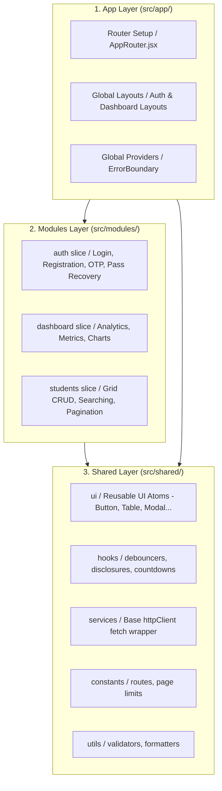
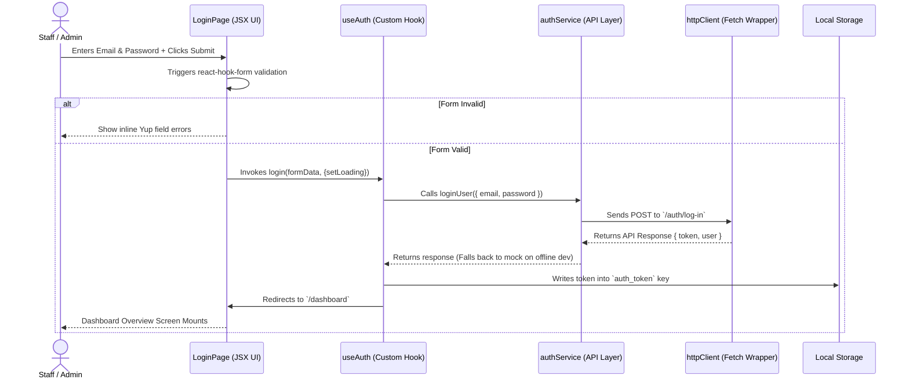

# EduVerse — Technical & Architectural Documentation

**Document version:** 1.0  
**Generated:** May 25, 2026  
**Project Name:** EduVerse (إديو فيرس)  
**Architecture Methodology:** Feature-Sliced Design (FSD)  
**Frontend Engine:** React 19 + Vite 8 + Tailwind CSS v4 (Alpha/Stable Integration)  
**Primary Target Directory:** `d:\dellllll\front_pro\EMA-X\Edu-vers`

---

## Table of Contents

1. [Project Overview](#1-project-overview)
2. [Architectural Paradigm: Feature-Sliced Design (FSD)](#2-architectural-paradigm-feature-sliced-design-fsd)
3. [Technology Stack & Core Dependencies](#3-technology-stack--core-dependencies)
4. [Folder Structure Deep Dive](#4-folder-structure-deep-dive)
5. [Global Configuration & Configurations](#5-global-configuration--configurations)
6. [UI/UX & Styling System (Tailwind CSS v4)](#6-uiux--styling-system-tailwind-css-v4)
7. [Detailed Modules Specifications](#7-detailed-modules-specifications)
    - [7.1 Authentication Module (`src/modules/auth`)](#71-authentication-module-srcmodulesauth)
    - [7.2 Dashboard Module (`src/modules/dashboard`)](#72-dashboard-module-srcmodulesdashboard)
    - [7.3 Students Module (`src/modules/students`)](#73-students-module-srcmodulesstudents)
8. [Shared Layer Analysis (`src/shared`)](#8-shared-layer-analysis-srcshared)
    - [8.1 Shared UI Primitives (`src/shared/ui`)](#81-shared-ui-primitives-srcsharedui)
    - [8.2 Reusable Custom Hooks (`src/shared/hooks`)](#82-reusable-custom-hooks-srcsharedhooks)
    - [8.3 Core Services (`src/shared/services`)](#83-core-services-srcsharedservices)
    - [8.4 Core Constants (`src/shared/constants`)](#84-core-constants-srcsharedconstants)
    - [8.5 Core Utilities (`src/shared/utils`)](#85-core-utilities-srcsharedutils)
9. [Data Flow & Separation of Concerns](#9-data-flow--separation-of-concerns)
10. [Routing & Protection Strategy](#10-routing--protection-strategy)
11. [Error Handling & Application Resilience](#11-error-handling--application-resilience)
12. [Developer Integration & Execution Guide](#12-developer-integration--execution-guide)

---

## 1. Project Overview

### Purpose
**EduVerse** is a premium, state-of-the-art school management administrative system designed to orchestrate academic operations, student listings, academic staff records, registration, and grade management. It serves as a unified workspace that bridges administrative controllers with comprehensive metrics, analytical representations, and data-bound student registries.

### Key Value Propositions
* **High Modularity:** Built using strict architectural boundaries to guarantee that large-scale feature expansion (e.g., grading dashboards, registration tables) does not result in code spaghettification.
* **Figma-Compliant Premium UI:** Implements high-end design cues matching the Figma specifications, including responsive layout splits, rich gradients, smooth interactive animations, customized tooltips, and dynamic stat badges.
* **Bespoke Performance Engine:** Route-level code-splitting (React Lazy/Suspense) and debounced searching logic are baked natively into custom hooks, ensuring optimal CPU cycles and minimized rendering triggers.

---

## 2. Architectural Paradigm: Feature-Sliced Design (FSD)

EduVerse is designed in strict accordance with the **Feature-Sliced Design (FSD)** architecture. FSD organizes codebases based on hierarchical layers, where a module in a higher layer can import from a lower layer, but lower layers can never import from higher layers. This creates a solid one-way dependency graph.

### Architectural Mapping



### FSD Layer Hierarchy in EduVerse

1. **App Layer (`src/app/`)**: The initializer. Contains the base mounting scripts (`main.jsx`), global styling layers (`index.css`), the entry wrapper (`App.jsx`), router matrices (`AppRouter.jsx`), global layouts (`AuthLayout.jsx`, `DashboardLayout.jsx`), and runtime error catchers (`ErrorBoundary.jsx`).
2. **Modules Layer (`src/modules/`)**: Houses discrete, autonomous business units. Each module consists of its own nested directories (`pages`, `components`, `hooks`, `services`, `validations`, `constants`).
3. **Shared Layer (`src/shared/`)**: A collection of fully decoupled, generic primitives. This is the foundation of the project, completely clean of application business logic.

---

## 3. Technology Stack & Core Dependencies

The frontend environment is fully tailored to utilize the latest, highly performant libraries on the modern web ecosystem:

| Core Technology / Library | Version | Role / Purpose | Scope of Usage |
| :--- | :--- | :--- | :--- |
| **React** | `^19.2.6` | Component-based UI engine | Application-wide |
| **Vite** | `^8.0.12` | Next-gen bundler, HMR, and server dev environment | Build-pipeline & dev execution |
| **Tailwind CSS v4** | `^4.3.0` | Next-generation utility-first styling pipeline | Global CSS + Utility bindings |
| **@tailwindcss/vite** | `^4.3.0` | Native CSS-compiler integration for Vite | Build compilation layer |
| **React Router DOM** | `^7.15.1` | Client-side routing engine & nested route mapping | Routing configuration |
| **React Hook Form** | `^7.76.0` | Uncontrolled form orchestrator | Auth pages (`LoginPage`, `CreateAccountPage`) |
| **Yup** | `^1.7.1` | Declarative object schema validator | Form constraints & field rules |
| **@hookform/resolvers**| `^5.4.0` | Bridging hook-form with schema validators | `yupResolver` implementation |
| **Lucide React** | `^1.16.0` | Aesthetic icon library | Throughout headers, inputs, navigation, sidebars |

---

## 4. Folder Structure Deep Dive

The layout tree inside the workspace is organized into highly structured folders:

```
src/
├── main.jsx                 # Application mounting entry point
├── App.jsx                  # Root container component wrapping ErrorBoundary
├── index.css                # Global styles, fonts, and Tailwind CSS v4 variables
├── App.css                  # Component-specific CSS fallbacks
│
├── app/                     # APP LAYER: Global initialization & layout settings
│   ├── layouts/
│   │   ├── index.js         # Layout aggregator exports
│   │   ├── AuthLayout.jsx   # Two-column visual layout for forms
│   │   └── DashboardLayout.jsx # Fixed sidebar + dynamic topbar wrapper
│   ├── providers/
│   │   └── ErrorBoundary.jsx # React class to catch render-time exceptions
│   └── router/
│       ├── index.js         # Single routing entry export
│       └── AppRouter.jsx    # Complete lazy route mapping matrices
│
├── modules/                 # MODULES LAYER: Features & Business units
│   ├── auth/                # Auth slice (registration, login, OTP validation)
│   │   ├── components/      # Auth-specific structural components (e.g. AuthHeader)
│   │   ├── constants/       # Auth routes, page title texts, copies
│   │   ├── hooks/           # useAuth login executor, useOTP counter hooks
│   │   ├── layouts/         # Nested layout hooks if needed
│   │   ├── pages/           # Pages (LoginPage, CreateAccountPage, ForgotPasswordPage, etc.)
│   │   ├── services/        # authService.js (Mock endpoints falling back to HTTP calls)
│   │   ├── validations/     # yup validator schemas (loginSchema, registerSchema)
│   │   └── index.js         # External module boundary exports
│   │
│   ├── dashboard/           # Dashboard slice (analytics, charts, overview metrics)
│   │   ├── components/      # Dashboard cards, interactive visual components
│   │   ├── pages/           # DashboardPage.jsx
│   │   └── index.js         # Module entry
│   │
│   └── students/            # Students slice (student CRUD registry, listing)
│       ├── components/      # Toolbars, table cells, action indicators
│       ├── constants/       # Mock datasets, column headers
│       ├── hooks/           # useStudents fetcher & filter manager
│       ├── pages/           # StudentsPage.jsx
│       ├── services/        # studentsService.js (HTTP network/mock methods)
│       └── index.js         # Module entry
│
└── shared/                  # SHARED LAYER: Decoupled, generic modules
    ├── constants/           # Global single-source constants (appConstants.js)
    ├── hooks/               # useDebounce, useCountdown, useDisclosure, etc.
    ├── services/            # httpClient.js (Native fetch-wrapper wrapper)
    ├── ui/                  # Reusable atomic buttons, inputs, modal, table, topbar...
    │   ├── index.js         # Aggregator for clean imports
    │   └── [UI Component]/  # Directory per primitive (e.g. Button/Button.jsx)
    └── utils/               # formatters, validators
```

---

## 5. Global Configuration & Configurations

### Vite Setup (`vite.config.js`)
Configured to resolve relative import directories elegantly using the `@/*` alias which references the `src/*` folder.
```javascript
import { defineConfig } from 'vite';
import react from '@vitejs/plugin-react';
import { fileURLToPath, URL } from 'node:url';

export default defineConfig({
  plugins: [react()],
  resolve: {
    alias: {
      '@': fileURLToPath(new URL('./src', import.meta.url)),
    },
  },
});
```

### Compiler Path Mapping (`jsconfig.json`)
Allows editors (VS Code / WebStorm) to autodetect paths correctly during pair programming:
```json
{
  "compilerOptions": {
    "target": "ESNext",
    "module": "ESNext",
    "moduleResolution": "Node",
    "baseUrl": ".",
    "paths": {
      "@/*": ["src/*"]
    }
  },
  "include": ["src/**/*"]
}
```

---

## 6. UI/UX & Styling System (Tailwind CSS v4)

EduVerse employs the new **Tailwind CSS v4** layout engine. Unlike v3, v4 is compiled via CSS variables directly configured inside the `@theme` directive within `src/index.css`.

### Design Tokens & Custom CSS Variables
```css
@theme {
  --color-main: #15B392;              /* Emerald Teal - Primary theme color */
  --color-main-hover: #129a7d;        /* Hover tone for brand buttons */
  --color-lighter-main: #E5F6F3;      /* Very soft teal background layer */
  --color-dark-blue: #233142;         /* Dark navy for card titles / headers */
  --color-dark-text: #0F172A;         /* Charcoal black for primary body text */
  --color-gray-text: #64748B;         /* Muted gray for descriptions / subtitles */
  --color-gray-light: #94A3B8;        /* Soft gray for input placeholders / boundaries */
  --color-percentage-up: #00C853;     /* Success Green for metrics and trends */
  --color-percentage-down: #FF3D00;   /* Error Red for metrics losses */
  --color-bg-app: #F4F7F6;            /* Application-wide body backdrop color */
  --font-sans: 'Inter', sans-serif;   /* Primary sans-serif font */
}
```

### Global Fonts
Imports the professional, Figma-standard **Inter** font families via Google Web Fonts, rendering with high anti-aliasing configurations:
```css
@import url('https://fonts.googleapis.com/css2?family=Inter:wght@300;400;500;600;700;800;900&display=swap');

@layer base {
  html {
    font-family: var(--font-sans);
  }
  body {
    background-color: var(--color-bg-app);
    color: var(--color-dark-text);
    -webkit-font-smoothing: antialiased;
  }
}
```

### Micro-Animations
Configures hardware-accelerated animations for page loads, dialog overlays, dropdown toggles, and screen entries:
* **Fade In (`.animate-fade-in`)**: Opacity scaling from `0` to `1` over `0.2` seconds using a custom cubic-bezier.
* **Slide Up (`.animate-slide-up`)**: Upward layout translation (`15px` to `0`) and micro-scaling (`0.97` to `1`) over `0.25` seconds.

---

## 7. Detailed Modules Specifications

### 7.1 Authentication Module (`src/modules/auth`)

Manages the multi-step user identification and credentials recovery workflows.



#### Files Structure Breakdown
* **`validations/loginSchema.js`**: Declarative Yup schemas enforcing:
  * `email`: Required, valid email format.
  * `password`: Required, minimum 6 characters.
* **`hooks/useAuth.js`**: Custom state machine encapsulation that exposes `{ login, error }` functions. Decoupled from rendering cycles.
* **`services/authService.js`**: Implements endpoints for authentication:
  1. `loginUser`: Logs in staff, returning token credentials.
  2. `createAccount`: Registers new accounts.
  3. `confirmEmail`: Confirms account OTP verification codes.
  4. `resendOtp`: Resends validation codes.
  5. `sendPasswordResetOtp`: Dispatches recovery link emails.
  6. `resetPassword`: Registers new credentials using recovery tokens.
  7. `verifyOtp`: Checks verification validity.

---

### 7.2 Dashboard Module (`src/modules/dashboard`)

Constructs the visual landing analytics panel, exposing metrics, progress benchmarks, and dynamic charts.

#### Features Overview
1. **Interactive Enrollment Charts**: Rendered using a fully dynamic chart framework styled as sleek metric columns. Features an interactive dropdown to select time ranges (e.g. `Last 3 Months`, `Last 6 Months`, `Last Year`), updating state dynamically. Exposes interactive tooltips on mouse hover:

| Data Range Selected | Chart Dataset Columns Rendered |
| :--- | :--- |
| **Last 3 Months** | APR (50%), MAY (75%), JUN (95% Active) |
| **Last 6 Months** | JAN (55%), FEB (40%), MAR (80% Active), APR (60%), MAY (70%), JUN (90%) |
| **Last Year** | JUL, AUG, SEP, OCT, NOV, DEC, JAN, FEB, MAR, APR, MAY, JUN |

2. **Figma Mockup Analytics Stat Grid**: Houses four key status blocks:
   * **Total Students**: `12,450` (Trend: `+12%`, Status: `Positive`)
   * **Total Courses**: `156` (Trend: `+4%`, Status: `Positive`)
   * **Total Doctors**: `84` (Trend: `0%`, Status: `Neutral`)
   * **Registered Courses**: `3,200` (Trend: `+18%`, Status: `Positive`)

3. **Academic Distribution Metrics**: Renders visual indicator bars calculating departments shares:
   * *Computer Science*: `45%` (Teal `#0D9488`)
   * *Business Admin*: `30%` (Blue-Sky `#0ea5e9`)
   * *Medical Studies*: `15%` (Navy `#1e3a8a`)
   * *Engineering*: `10%` (Violet `#8b5cf6`)

4. **Recent Registers Registry**: Displays a structured data grid fetching the latest registered accounts, featuring avatar generation based on student initials, email listings, and rapid action triggers (view profile).

---

### 7.3 Students Module (`src/modules/students`)

Implements the student tracking index panel utilizing strict search debounce routines and paging configurations.

#### Files Structure Breakdown
* **`StudentsPage.jsx`**: A purely presentational template. Exposes a clean layout containing a top header bar, "+ Add New Student" action button, and filters. Delegates actions to `useStudents` hook.
* **`hooks/useStudents.js`**: Decouples search inputs, status selections, current page indices, loading overlays, and lists state management. Consumes the `useDebounce` hook (`400ms`) to prevent hitting the API on every keystroke. Exposes `refetch()` functionality.
* **`services/studentsService.js`**: Houses CRUD interactions:
  * `fetchStudents({ search, status, page, pageSize })`: Performs client-side pagination, casing filters, and matching query sequences before returning `{ data, total }`.
  * `deleteStudent(id)`: Mocks student records removal.
* **`constants/studentsConstants.jsx`**: Exposes table configuration models. Column metadata includes:
  * `Student ID` (`key: id`)
  * `Name` (`key: name`)
  * `Email Address` (`key: email`)
  * `Major` (`key: major`)
  * `Status` (`key: status`): Formatted inside a dynamic HTML template returning:
    * Active Status: `bg-percentage-up/10 text-percentage-up`
    * Inactive Status: `bg-percentage-down/10 text-percentage-down`

---

## 8. Shared Layer Analysis (`src/shared`)

### 8.1 Shared UI Primitives (`src/shared/ui`)

Generic visual atoms used to compose pages.

```
src/shared/ui/
├── index.js          # Export aggregator
├── Button/           # Brand-compliant action button
├── Card/             # Standard container panel
├── FormField/        # Form field container with label & error text
├── Input/            # Base textual input field with icons support
├── Select/           # Standard select field component
├── Modal/            # Reusable absolute portal modal overlay
├── Table/            # Dynamic grid table with loading wrappers
├── Pagination/       # Standard pages navigators
├── Loader/           # CSS spinner animation
├── EmptyState/       # Visual indicator for empty records
├── Sidebar/          # Main dashboard sidebar navigation
└── Topbar/           # Navigation header housing searches & actions
```

#### Highlighted UI Atoms:
* **Topbar**: A premium bar container sticky-aligned to the top, hosting a global search input (`Search` icon, rounded, with active focus teal borders), quick CTAs, and user control features.
* **Sidebar**: A static sidebar with premium branding. Generates interactive items linked with `NavLink` (exposing active and inactive styles: `#EFF2FC` light-purple background and `#0D9488` teal active text). Houses an organic administrative card profile at the bottom showing current user details (e.g. `Alex Johnson`, `Head of IT`).
* **Table**: A reusable component that takes header models and data arrays, rendering elegant loading indicators and custom layouts.

---

### 8.2 Reusable Custom Hooks (`src/shared/hooks`)

Exposes generic React lifecycle utilities:
* **`useDebounce.js`**: Accepts a state value and delay interval. Delays state updates until the timer expires. Essential for search performance optimizations.
* **`useCountdown.js`**: Returns ticking second states and reset functions. Utilized during OTP authentication timers.
* **`useDisclosure.js`**: Standardizes boolean flags manipulation (`isOpen`, `onOpen`, `onClose`, `onToggle`). Useful for modals.
* **`useLocalStorage.js`**: Automatically synchronizes state changes with browser `localStorage`.

---

### 8.3 Core Services (`src/shared/services`)

#### `httpClient.js` (Fetch Abstraction Wrapper)
Exposes an elegant wrapper interface covering native HTTP queries. Provides default setup hooks to inject credentials and catch response states.
* **Interceptors Setup**: Automatically captures and injects Bearer JWT authentication tokens extracted from `localStorage.getItem('auth_token')`.
* **Central Base URL Configuration**: Extracted automatically from the environment setup variable `import.meta.env.VITE_API_BASE_URL`.
* **Automatic Parsing**: Handles status validations, parses JSON contents, and handles `204 No Content` queries gracefully.

---

### 8.4 Core Constants (`src/shared/constants`)

#### `appConstants.js`
Serves as the single source of truth for routing URLs and key configuration metrics across the codebase.
```javascript
export const ROUTES = {
  HOME:             '/',
  LOGIN:            '/login',
  REGISTER:         '/create-account',
  FORGOT_PASSWORD:  '/forgot-password',
  VERIFY_OTP:       '/verify-otp',
  RESET_PASSWORD:   '/reset-password',
  DASHBOARD:        '/dashboard',
  STUDENTS:         '/dashboard/students',
  STAFF:            '/dashboard/staff',
  COURSES:          '/dashboard/courses',
  REGISTRATION:     '/dashboard/registration',
  GRADES:           '/dashboard/grades',
};

export const APP_NAME = 'EduVerse';
export const PAGE_SIZE_DEFAULT = 5;
```

---

### 8.5 Core Utilities (`src/shared/utils`)

* **`formatters.js`**: Methods to parse timestamps, dates, currencies, and long strings.
* **`validators.js`**: Simple helper functions for field validation checks.

---

## 9. Data Flow & Separation of Concerns

EduVerse implements a unidirectional, highly decoupled data management flow:

```
[ User Interaction ]
         │
         ▼
[ Presentation Page (Pure UI Shell) ]
         │ (calls handler)
         ▼
[ Custom Module Hook (State Management) ]
         │ (invokes)
         ▼
[ Module Service (API Client Call) ]
         │ (executes request)
         ▼
[ Shared HttpClient (Base Fetch / Auth Headers) ]
         │ (network query)
         ▼
[ Backend / API Endpoints ]
```

---

## 10. Routing & Protection Strategy

Client-side routes are configured in `src/app/router/AppRouter.jsx` utilizing the robust **React Router DOM v7** engine:

* **Route-Level Code Splitting**: All pages are dynamically split into decoupled bundle segments utilizing `React.lazy()` and rendered under a React `Suspense` container. While a segment is loading, a full-screen dynamic CSS loader (`Loader`) is presented.
* **Routing Table Matrix**:

| Path Pattern | Component Resolved | Layout Theme Applied | Route Protection Mode |
| :--- | :--- | :--- | :--- |
| `/` | Redirects to `/login` | — | None (Public) |
| `/login` | `LoginPage` | `AuthLayout` | Public |
| `/create-account`| `CreateAccountPage` | `AuthLayout` | Public |
| `/forgot-password`| `ForgotPasswordPage` | `AuthLayout` | Public |
| `/verify-otp` | `OTPVerificationPage` | `AuthLayout` | Public |
| `/reset-password`| `ResetPasswordPage` | `AuthLayout` | Public |
| `/dashboard` | `DashboardPage` | `DashboardLayout` | Private / Protected |
| `/dashboard/students`| `StudentsPage` | `DashboardLayout` | Private / Protected |
| `*` | Redirects to `/login` | — | Fallback Redirect |

---

## 11. Error Handling & Application Resilience

### `ErrorBoundary.jsx`
EduVerse intercepts unexpected render-time Javascript exceptions before they crash the application or show a blank white screen using a robust fallback component.

#### Implementation Highlights:
* Captures issues dynamically in sub-elements using the lifecycle method `getDerivedStateFromError()`.
* In local development environments (`import.meta.env.DEV`), prints detailed runtime crash reports inside an elegant, scrollable code preview panel.
* In production, hides details behind a clean visual explanation, offering the user recovery steps ("Try Again" state reset or "Reload Page").

---

## 12. Developer Integration & Execution Guide

### Workspace Setup

To spin up the project workspace locally for development:

1. **Install Dependencies**:
   ```bash
   npm install
   ```

2. **Configure Environment Variables**:  
   Create a `.env` or `.env.local` file inside the root directory and specify the backend entry point:
   ```env
   VITE_API_BASE_URL=https://api.eduverse.com/v1
   ```

3. **Start the Development Server**:
   ```bash
   npm run dev
   ```
   *Uses Vite HMR to load CSS changes compiled with the new Tailwind v4 compiler instantly.*

4. **Build the Production Bundle**:
   ```bash
   npm run build
   ```
   *Compiles output segments inside the `/dist` directory.*
